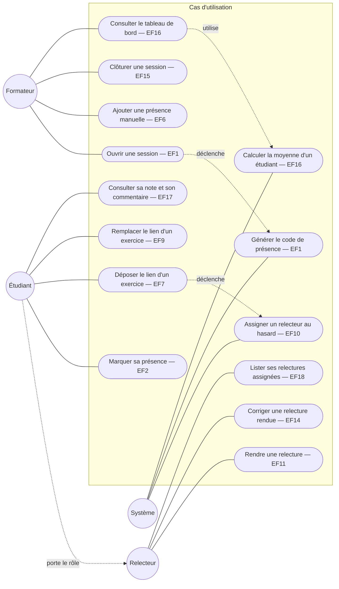

# D1 — Cas d'utilisation

Acteurs et ce que chacun peut faire. Le rôle "Relecteur" est porté par un étudiant présent à la session (cf. cahier des charges, section 2) : il n'a pas de compte séparé, c'est pourquoi il hérite des cas d'utilisation de l'Étudiant.

Mermaid ne propose pas de notation UML "cas d'utilisation" native ; on la représente ici en flowchart : les acteurs à gauche/droite, les cas d'utilisation au centre (bulles), une ligne = une association. Les cas d'utilisation du Système (assignation, génération de code, calcul de moyenne) sont automatiques, déclenchés par les actions des autres acteurs.

