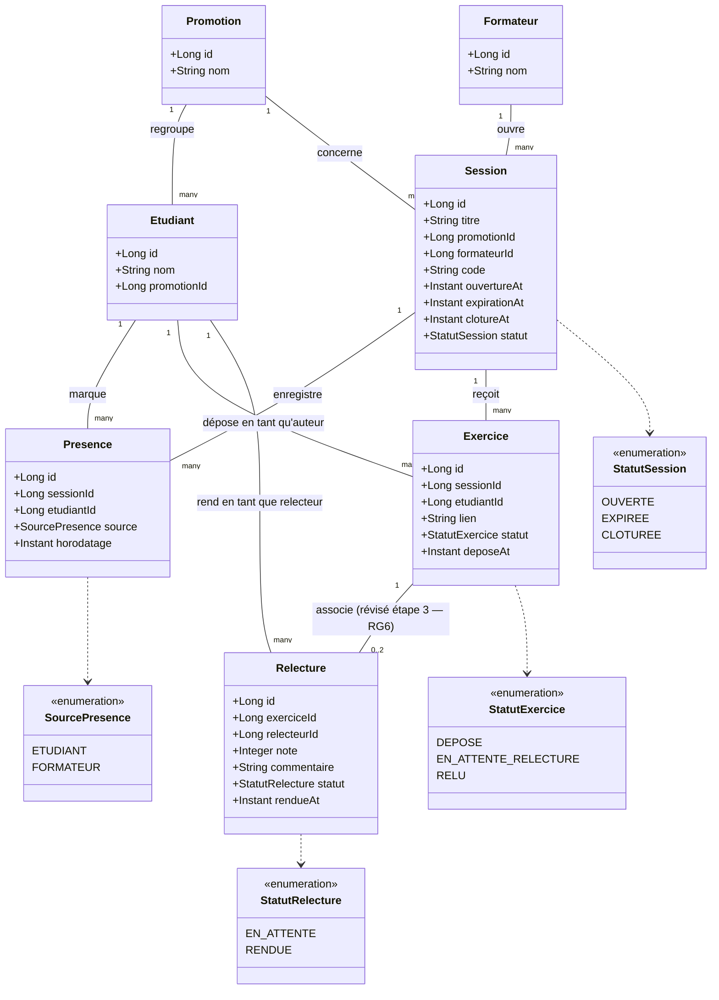

# D2 — Classes / modèle de données

Ce diagramme doit correspondre exactement aux migrations Flyway/Liquibase du backend (cf. contrainte B5). Toute divergence lors du développement doit être répercutée ici dans le même commit.

## Notes de cohérence avec les règles de gestion

- `Session.code` + `expirationAt` portent RG1/RG2 (expiration 15 min).
- L'unicité `(sessionId, etudiantId)` sur `Presence` porte RG3 (une seule présence par session).
- `Presence.source` porte RG14 (traçabilité d'un ajout manuel par le formateur).
- L'unicité `(sessionId, etudiantId)` sur `Exercice` porte le refus de second dépôt (EF7/EF8) ; le remplacement du lien (RG13) est une mise à jour de cette même ligne, pas une nouvelle ligne.
- L'unicité `(exerciceId, relecteurId)` sur `Relecture` porte RG6 révisée (deux relecteurs *différents* par exercice, jamais le même deux fois) — remplace l'ancienne unicité sur `exerciceId` seul (V7, migration additive, voir section 7 de l'enveloppe étape 3) ; `relecteurId != Exercice.etudiantId` porte RG5 (interdiction d'auto-relecture), vérifié en base par contrainte applicative (pas de contrainte SQL simple possible sans jointure).
- La note finale (RG17) n'est pas stockée : elle se calcule à la lecture à partir des `Relecture.statut = RENDUE` liées au même `exerciceId` (moyenne si deux, valeur seule marquée provisoire si une).
- `Relecture.note` contraint entre 0 et 20 porte RG9.
- `Session.clotureAt` (nullable) porte RG15 : tant qu'il est `null`, RG10 permet la correction d'une relecture rendue.
