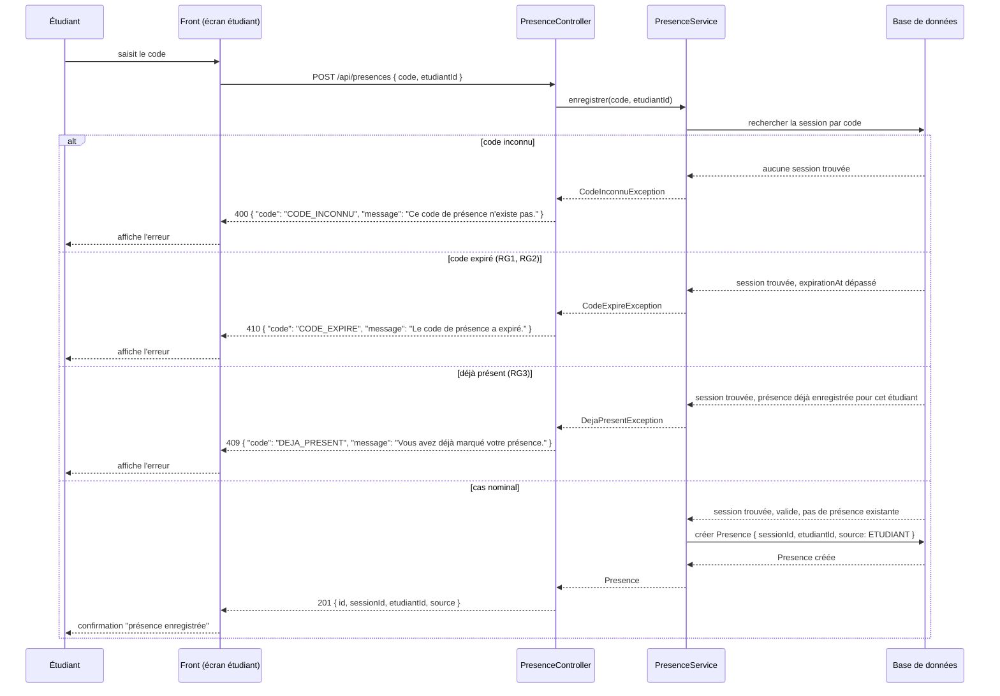

# D3 — Séquence : marquer sa présence

Cas nominal et trois cas d'erreur (dont les deux imposés : code expiré et étudiant déjà présent), cohérents avec les codes HTTP et le format d'erreur imposés par `api/contrat.yaml` (Annexe B).

## Note — RG4 (blocage après 5 erreurs)

Le blocage de 2 minutes après 5 codes invalides consécutifs (RG4) est un compteur tenu côté `PresenceService` par étudiant + session, hors du diagramme ci-dessus pour ne pas surcharger le cas nominal. Il se traduit par une erreur `429 { "code": "TROP_DE_TENTATIVES", "message": "..." }` tant que le blocage est actif, avant même la recherche du code.
