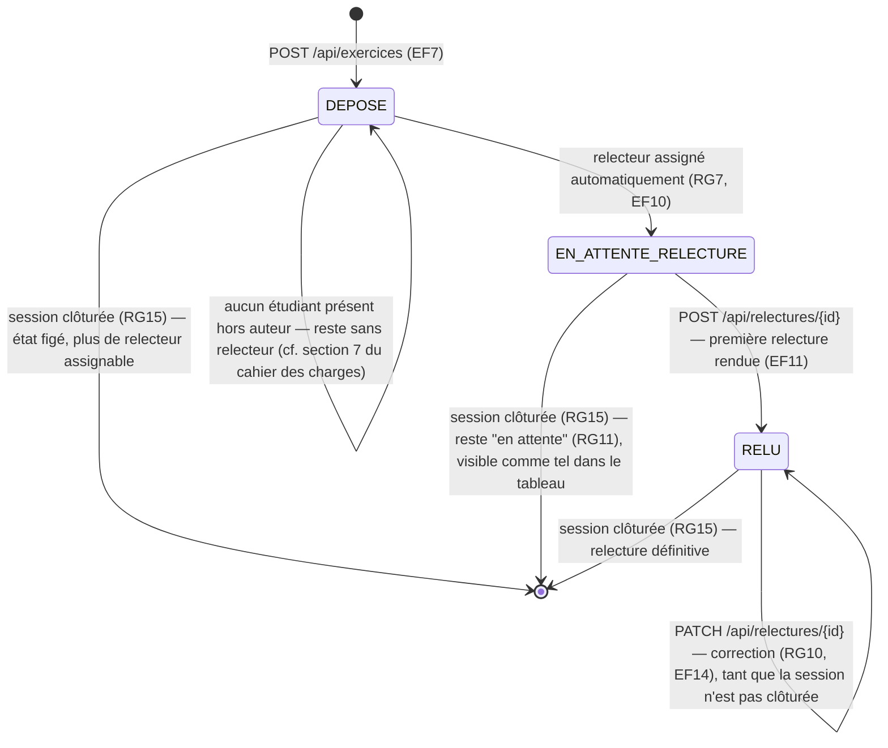

# D4 (bonus) — États-transitions du cycle de vie d'un exercice

Les trois transitions vers `[*]` en bas ne suppriment rien : elles marquent que la clôture de session (RG15) fige l'état atteint, quel qu'il soit — y compris `EN_ATTENTE_RELECTURE`, qui reste alors visible au formateur comme "en attente" sans jamais être relu (RG11).
